
# I learned about a few things
## Now I'll tell you about them
---

- Eight topics
* One minute each
* Let's go

---
<!-- class: fibonacci -->
# 1. A Hebrew lesson
### a. Common words and phrases 

<!-- transition: none -->

---

# 1. A Hebrew lesson
### a. Common words and phrases

<section>
תודה. בבקשה.

*(Todah. B'vahkeshah.)*

Thank you. You're welcome.
</section>

<!-- transition: none -->

---

# 1. A Hebrew lesson
### a. Common words and phrases

<section>
.יריתי בציפור שלך כי היית איום

*(yariti betzipur shlach ki hayat ium)*

I bolted your bird because you are the threat.
</section>

<!-- transition: none -->

---
# 1. A Hebrew lesson
### a. Common words and phrases

.לאכול זכוכית

*(lachul zhuhit)*

Eat glass.

<!-- transition: fade -->
---

# 1. A Hebrew lesson
### b. Shoreshim 

* "Shoresh" means "root", "-im" is pluralization
   * So, "roots"
* Means by which words are constructed in Hebrew and other Semitic languages

---

# 1. A Hebrew lesson
### b. Shoreshim

|Hebrew word|pronunciation|meaning|
|---|---|---|
|מֶלךְ| _(melekh)_ | king
|מַלְכוּת | _(malkut)_ | kingdom

<!-- transition: cube -->
---
# 2. The history of celebrating birthdays 
* Initially important for astrological reasons
* Ancient Egypt: birthdays for royalty
* Ancient Greece: birthdays for men (and candles on cakes)
* 14th century: every infant was given the name of a saint as a protector. People celebrated their saint’s day, not their own birthday. 

<!-- transition: none -->
---
# 2. The history of celebrating birthdays
- The modern children's birthday party came from Germany (kinderfeste) in the early 19th century, an era when the individual person was seen as important and when childhood was “discovered” as a special stage of life.

<!-- transition: cube-->

---

# 3. The mixolydian scale

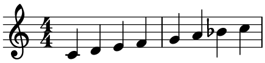

* It's just a major scale except that the seventh note (the 7) is flat

---

<video controls width=800 onclick="this.play()">

<source src="./images/sonic-3-hookpad.mp4"  type="video/mp4" />

</video>

<!-- transition: cube -->
---
# 4. Elephant grass 
<!-- class: not-fibonacci -->
<!-- footer: "Illus. Tony Roberts. Map from tropicalforages.info"-->
<!-- Number four is elephant grass, a plant I learned about from the Magic: the Gathering card of the same name. It's native to sub-Saharan Africa, and it grows to a height of 4-7 meters, or 108 cheeseburgers on average. You can feed it to elephants, but you can also make paper with it, and you can also use it as part of a pest control method called push-pull. 

Maize is responsible for one-third of all the calories consumed in sub-Saharan Africa. It is parasited upon by an insect called the stemborer, which eats about ten percent of African maize crop yields annually. African farmers noticed that this insect is repelled by a plant called -->

<section class="two-cols">
	

		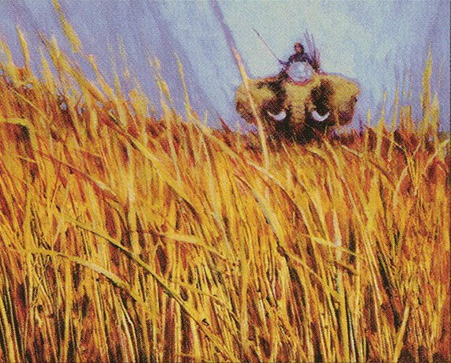
		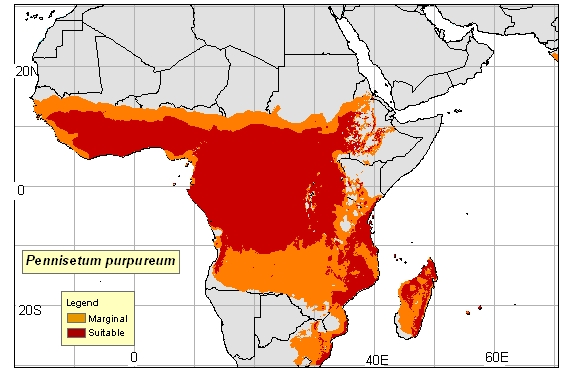
	

	

* Originates from sub-Saharan Africa 
<!-- 108 cheeseburgers -->
* Grows to a height of 4-7 meters
	

	

	

</section>

<!-- transition: none -->

---
# 4. Elephant grass
<!-- footer: ""-->

<section class="two-cols">

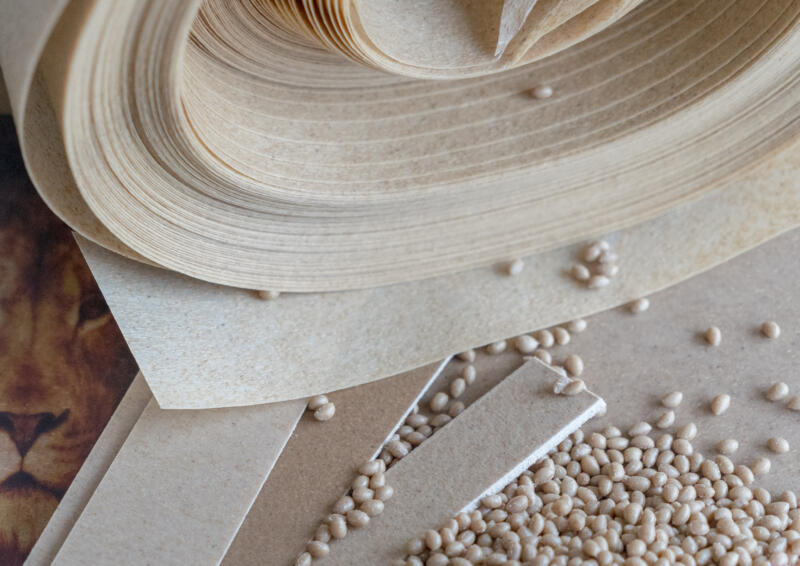
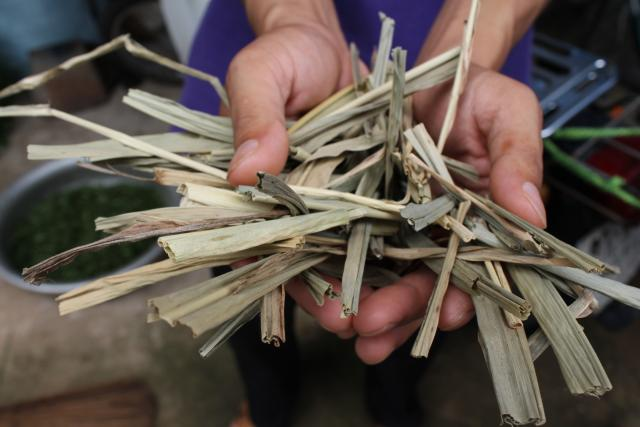

 Things you can do with it 

 other than let elephants eat it: 

* Make paper 

</section>

<!-- transition: none-->

---
# 4. Elephant grass
<!-- footer: "One third of all sub-Saharan calories thing: [here](https://www.tandfonline.com/doi/full/10.1080/87559129.2019.1588290). More about push-pull with elephant grass and Desmodium: [here](https://www.fhcanada.org/blog/how-does-push-pull-pest-management-work)." -->
<section class="two-cols">

<!-- You plant the desmodium in rows alternating with the corn; the insects get repelled by the smell and jump into the elephant grass you've planted around the perimeter; they lay their eggs in it, and they don't hatch because the grass is hairy so they fall off

Checkmate bugs-->

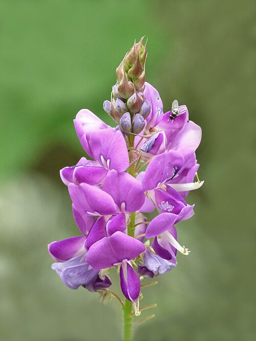

 Things you can do with it 

 other than let elephants eat it: 

* Important contributor to push-pull pest control (stops stemborers from eating maize)
   * Maize accounts for ~one third of all consumed calories in sub-Saharan Africa

</section>

<!-- transition: cube -->

---
<!-- footer: "" -->
<!-- class: not-fibonacci -->
# 5. The golden ratio 

<!-- Audio clip here of my saying "Stav I think you forgot to color this one gold"

Each fibonacci number in the talk will be gold

Golden rectangle but it's pictures of me and my family-->

<!-- transition: fade -->

---
<!-- class: fibonacci -->
# 5.  The golden ratio

<!-- transition: none -->

---

# 5.  The golden ratio
<section class="two-cols">

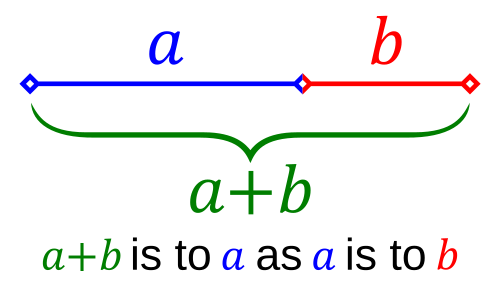

Defined as the ratio of *any* two lengths when the ratio a/b is equal to the ratio of the larger length with their sum, a+b/a 

</section>

---

# 5.  The golden ratio
<section class="two-cols">

 
1.618033988749...

</section>

---

# 5.  The golden ratio
<section class="two-cols">

</section>

---
# 5.  The golden ratio

<svg xmlns="http://www.w3.org/2000/svg" viewBox="0 0 1000 618" width="80%" height="80%">

<rect x="0" y="0" width="618" height="618" class="rect-base r1" stroke="#4a5568">
    <rect x="618" y="0" width="382" height="382" class="rect-base r2" stroke="#718096" fill="#2d3748" />
    <rect x="764" y="382" width="236" height="236" class="rect-base r3" stroke="#a0aec0" fill="#4a5568" />
    <rect x="618" y="472" width="146" height="146" class="rect-base r4" stroke="#cbd5e0" fill="#718096" />
    <rect x="618" y="382" width="90" height="90" class="rect-base r5" stroke="#e2e8f0" fill="#a0aec0" />
    <rect x="708" y="382" width="56" height="90" class="rect-base r6" stroke="#edf2f7" fill="#cbd5e0" />
    <path class="arc" d="
        M 0,618 
        A 618,618 0 0,1 618,0
        A 382,382 0 0,1 1000,382
        A 236,236 0 0,1 764,618
        A 146,146 0 0,1 618,472
        A 90,90 0 0,1 708,382
        A 56,56 0 0,1 764,427
        A 56,56 0 0,1 708,472
    " />
<defs>

</defs>
</svg>

---
# 5.  The golden ratio

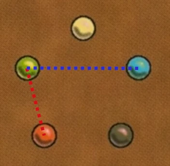

</section>

---
# 5.  The golden ratio

Conversion ratio of miles to kilometers = 1.60934
That's only 0.05% different! 

</section>

---

# 5.  The golden ratio

<section class="two-cols">

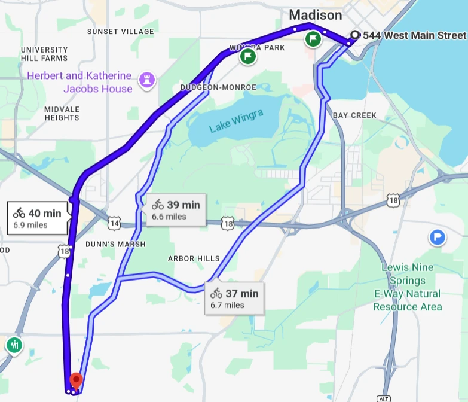

Distance to bike from Bird House to Hop Haus in Verona:

~7 miles 
= 5 miles + 2 miles
≈  8 km + 3 km
= 11 km.

(Real answer is 11.104km, error of 0.9%!)

</section>

<!-- transition: cube -->
---
<!-- class: not-fibonacci -->
# 6. Toilets 
<!-- transition: fade -->
---
<!-- class: not-fibonacci -->
# 6. Toilets 

<!-- footer: "thearchaeologist.org, \"Sanitation of the Indus Valley Civilisation\" "-->

<section class="two-cols">

<section class="smaller-text">

* Originally designed in the Indus River valley civilizations
 
* <i>"Several courtyard houses had both a washing platform and a dedicated toilet/waste disposal hole. The toilet holes would be flushed by emptying a jar of water, drawn from the house's central well, through a clay brick pipe, and into a shared brick drain, that would feed into an adjacent soak pit (cesspit)."</i>

</section>

<section>

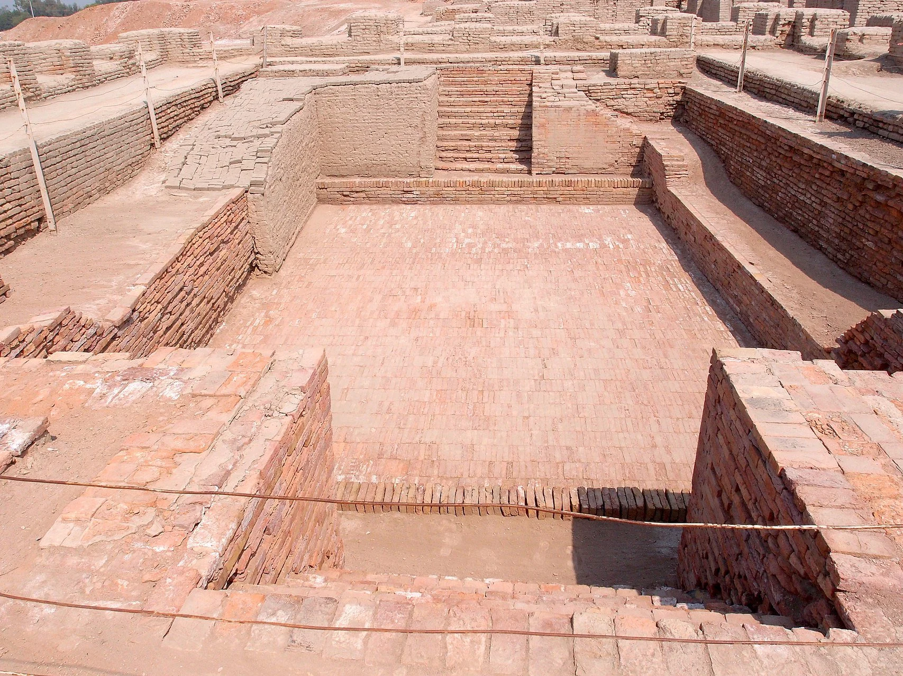
 The Great Bath at Mohenjo-Daro 
</section>

</section>

<!-- transition: none -->

---

<!-- footer: "sciencemuseum.org.uk, \"A flushing story\"" -->

# 6. Toilets

<section class="two-cols"> 

* 1596: Sir John Harington, in his *The Metamorphosis of Ajax*, describes a flushing device
* 1775: Alexander Cumming patents flushing toilet and provides the innovation of the S-pipe to seal odor away from the toilet bowl
* 1883: Twyford started using porcelain

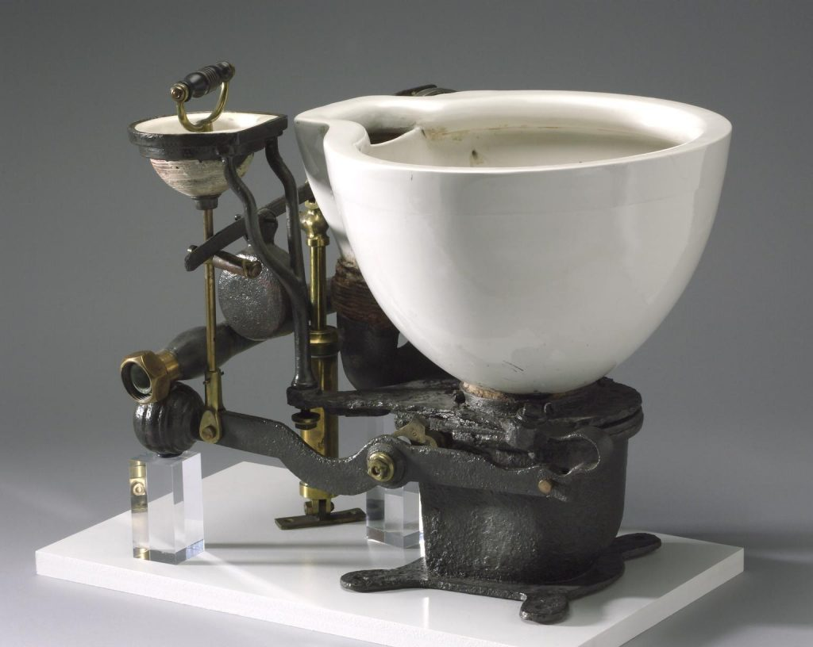

</section>

---
# 6. Toilets
<!-- footer: "" -->

<section class="two-cols">
	
 

 

	Now there are toilets that work in space by using a vacuum pump and airflow to direct waste into a water filtration system or a disposable bag
	

</section>

<!-- transition: cube -->
---

# 7. The art of Wylie Beckert 

<!-- transition: fade -->

---

# 7. The art of Wylie Beckert 

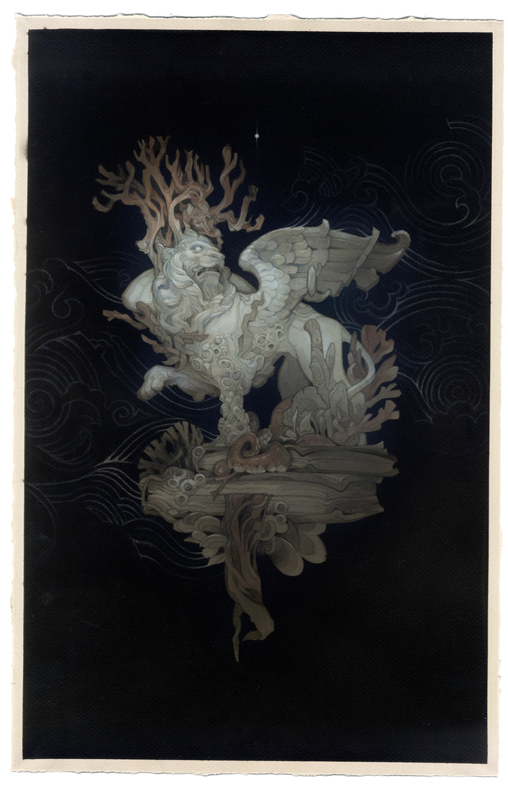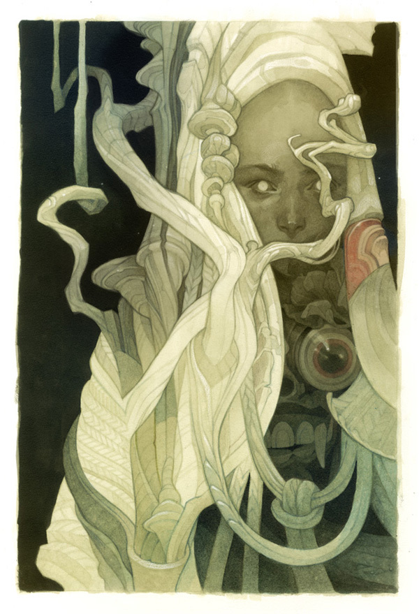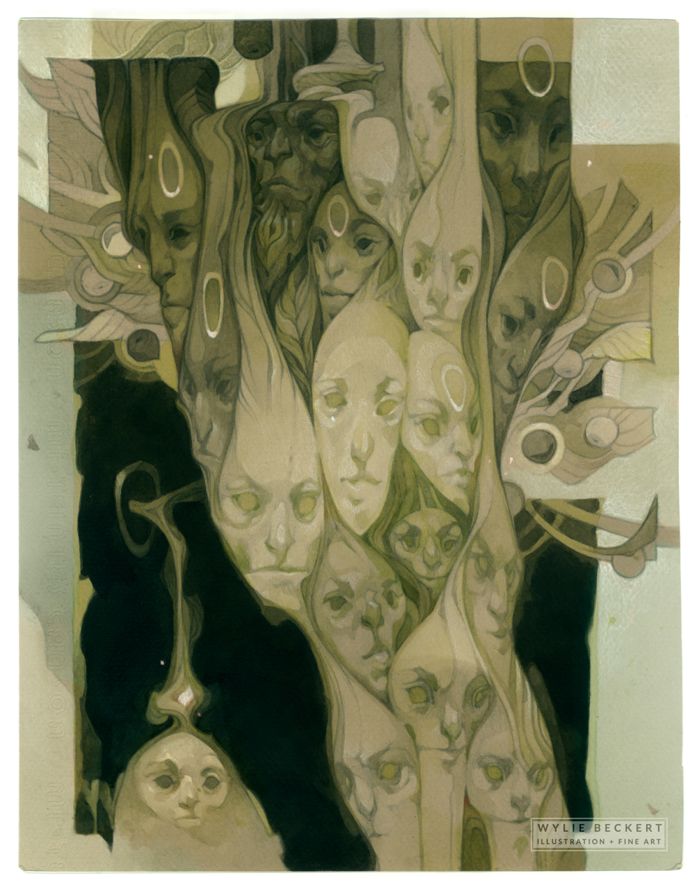

*"The simultaneously grim and playful images she creates are distinguished by their intricate detail, unexpected compositions, and narrative sensibility, offering a window into a fantastical world that is both sinister and inviting."*

<!-- transition: none -->

---
<!-- footer: "Wylie Beckert, <i>Creating a Targeted Illustration Sample</i>, MuddyColors.com" -->

## 7. The art of Wylie Beckert

*"To get hired by a specific client, it isn’t enough that work be “good” – it also has to be suited to the needs of the client...let’s say I want to get hired by [Wizards of the Coast]. The first thing I need to do is compare the work I’m doing to the work this client is hiring. Actually placing one of my own paintings among a few MTG pieces is rather eye-opening..."*

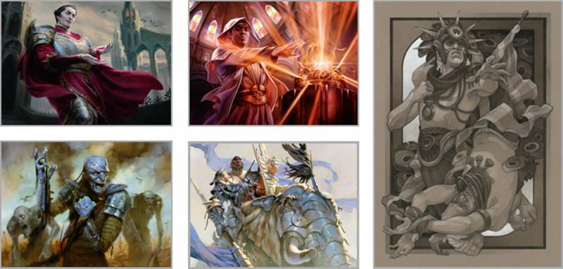
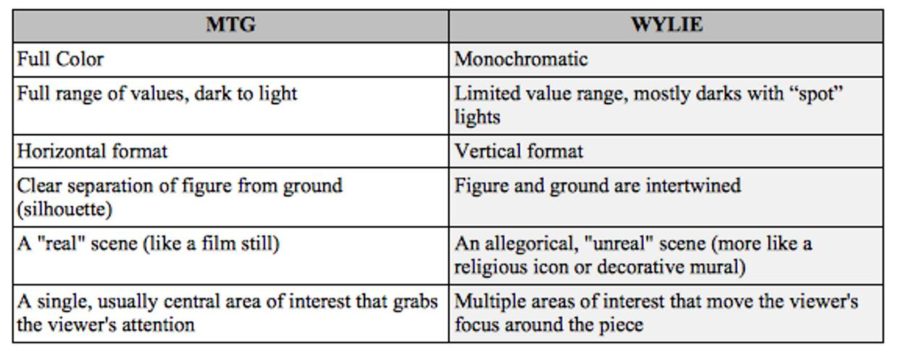

<!-- transition: cube -->

---
<!-- footer: "" -->
<!-- class: fibonacci -->
#  8.   Zeugma

	The use of a word to modify or govern two or more words, usually in such a manner that it applies to each word in a different sense.

>  You are free to execute your laws, and your citizens, as you see fit.

 Commander Riker

> Yet time and her aunt moved slowly — and her patience and her ideas were nearly worn our before the tete-a-tete was over.

 Jane Austen 

<!-- transition: fade -->

---
<!-- class: the-end -->

| | |
|----|----|
 1a| [Hebrew: phrases](#hebrew-phrases)
1b| [Hebrew: שורשים *(shoreshim)*](#hebrew-shoreshim)
2| [History of birthdays](#birthdays)
3| [The mixolydian scale](#mixolydian)
4| [Elephant grass](#elephant-grass)
5| [The golden ratio](#the-golden-ratio)
6| [History of toilets](#toilets)
7| [The art of Wylie Beckert](#wylie-beckert)
8| [Zeugma](#zeugma)

<!-- Fib sequence has two 1s, so that's why there's 1a and 1b -->
