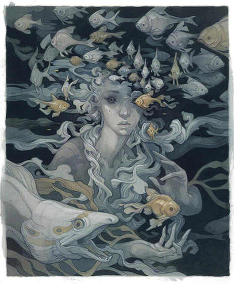

<!-- paginate: false -->

# 2026-06-13 

<!-- transition: none-->

---

- 8  topics
* One minute each
* Let's go

<!-- transition: cube -->

---

<!-- class: fibonacci topic1a -->
<!-- paginate: true -->

# 1. A Hebrew lesson
### a. Common words and phrases 

<!-- transition: none -->

---

# 1. A Hebrew lesson
### a. Common words and phrases

<section>
.תודה. בבקשה

*(Todah. B'vahkeshah.)*

Thank you. You're welcome.
</section>

<!-- transition: none -->

---

# 1. A Hebrew lesson
### a. Common words and phrases

<section>
.יריתי בציפור שלך כי היית איום

*(yariti betzipur shelach ki hayeet ium)*

I bolted your bird because you are the threat.
</section>

<!-- transition: none -->

---

# 1. A Hebrew lesson
### a. Common words and phrases

.תֹּאכְלוּ זכוכית 

*(to'chlu zchuchit)*

Eat glass.

<!-- transition: fade -->
---

# 1. A Hebrew lesson
### b. Shoreshim 

* "roots" 
   * "shoresh" means "root", "-im" is pluralization
* Means by which words are constructed in Hebrew and other Semitic languages

<!-- transition: none-->
---

# 1. A Hebrew lesson
### b. Shoreshim

|Hebrew word|pronunciation|meaning|
|---|---|---|
|מֶלךְ| _(melekh)_ | king
|מַלְכָּה | *(malkah)* | queen
|מַלְכוּת | _(malkut)_ | kingdom

<!-- transition: cube -->
---

# 2.  The history of birthdays

<!-- transition: fade -->
---

##  2.  The history of birthdays

<ul class="timeline">
	<li class="timeline-item">
		

        

            

                Egypt, ~3000 BCE
            

            

                
Celebrations for birthdays of royalty (important for astrological reasons)

            

        </li>
        <li class="timeline-item">
        

		

        

            

                Rome, 100s CE
            

            

                
Birthdays for non-royalty (and candles on cakes)

            

        

	</li>
	</li>
		<li class="timeline-item">
		

		

            

                Europe, 1300s CE
            

			

                
Every infant was given the name of a saint as a protector. People celebrated their saint’s day, not their own birthday. 

            

		

	</li>
	</li>
		<li class="timeline-item">
		

		

		

			Germany, 1700s CE
		

			

                
 <i>Kinderfeste</i>, root of the modern birthday party 

                
 This is when we start putting N candles on the cake 
 <!-- during an era when the individual person was seen as important and when childhood was “discovered” as a special stage of life (roots of modern birthday party) -->
            

		

	</li>
    <li class="timeline-item">
    

    

    

        

            Kentucky, 1893 CE
        

        

            Patty and Mildred Hill compose <i>Happy Birthday To You</i>, which will become the most recognized song in English
        

    

    </li>
</ul>

<!-- transition: cube -->

---

# 3. The mixolydian scale

<audio id="cmix" src="./images/c-mix-mode-scale.mp3"> </audio>

- It's just a major scale, 
except that the 
seventh note is flat

<!-- transition: none -->

---
# 3. The mixolydian scale

<video controls width=800 onclick="this.play()">

<source src="./images/sonic-3-hookpad.mp4"  type="video/mp4" />

</video>

<!-- transition: cube -->
---

<!--_class: not-fibonacci-->

# 4. Elephant grass

<!-- transition: fade -->
---

# 4. Elephant grass 
<!-- class: not-fibonacci -->
<!-- footer: "Illus. Tony Roberts. Map from tropicalforages.info"-->
<!-- Number four is elephant grass, a plant I learned about from the Magic: the Gathering card of the same name. It's native to sub-Saharan Africa, and it grows to a height of 4-7 meters, or 108 cheeseburgers on average. You can feed it to elephants, but you can also make paper with it, and you can also use it as part of a pest control method called push-pull. 

Maize is responsible for one-third of all the calories consumed in sub-Saharan Africa. It is parasited upon by an insect called the stemborer, which eats about ten percent of African maize crop yields annually. African farmers noticed that this insect is repelled by a plant called -->

 
<!-- 

    
    

 

 -->

<ul class="grass-fact">
<li data-marpit-fragment="1"> 

 Originates from sub-Saharan Africa 

<!-- 108 cheeseburgers -->

</li> 
<li data-marpit-fragment="2"> 

Grows to a height of 4-7 meters 

</li>

</ul>

<!-- transition: none -->

---

# 4. Elephant grass
<!-- footer: ""-->

 Things you can do with it 

 other than let elephants eat it: 

<ul class="grass-fact">
<li>

Make paper

</li>
</ul>

<!-- transition: none-->

---

# 4. Elephant grass
<!-- footer: "One third of all sub-Saharan calories thing: [here](https://www.tandfonline.com/doi/full/10.1080/87559129.2019.1588290). More about push-pull with elephant grass and Desmodium: [here](https://www.fhcanada.org/blog/how-does-push-pull-pest-management-work)." -->

<!-- You plant the desmodium in rows alternating with the corn; the insects get repelled by the smell and jump into the elephant grass you've planted around the perimeter; they lay their eggs in it, and they don't hatch because the grass is hairy so they fall off

Checkmate bugs-->

<ul class="grass-fact">

<li data-marpit-fragment="1">

Maize accounts for ~30% of all consumed calories in sub-Saharan Africa 

Stemborers eat ~10% of it annually

</li>
<li data-marpit-fragment="2"> 

 Desmondium can be used in conjunction with elephant grass as <b>push-pull pest control</b> 

</li>

</ul>

<!-- transition: cube -->

---

<!-- footer: "" -->
<!-- class: not-fibonacci -->
# 5. The golden ratio 

<!-- Audio clip here of my saying "Stav I think you forgot to color this one gold"

Each fibonacci number in the talk will be gold

Golden rectangle but it's pictures of me and my family-->

<!-- transition: fade -->

---

<!-- class: fibonacci -->
# 5.  The golden ratio

<!-- transition: none -->

---

# 5.  The golden ratio
<section class="two-cols">

Defined as the ratio of two lengths a/b, such that it is equal to the ratio of the larger length with their sum, a+b/a 

</section>

---

# 5.  The golden ratio
<section class="two-cols">

 
1.618033988749...

</section>

---

# 5.  The golden ratio
<section class="two-cols">

</section>

---

# 5.  The golden ratio

<svg xmlns="http://www.w3.org/2000/svg" viewBox="0 0 1000 618" width="80%" height="80%">

<image x="0" y="0" width="618" height="618" class="rect-base r6" href="./images/golds/stav-georgia.jpg" preserveAspectRatio="xMidYMid slice" />
<image x="618" y="0" width="382" height="382" class="rect-base r5" href="./images/golds/maya-stella.jpg" preserveAspectRatio="xMidYMid slice" />
<image x="764" y="382" width="236" height="236" class="rect-base r4" href="./images/golds/mom.jpg" preserveAspectRatio="xMidYMid slice" />
<image x="618" y="472" width="146" height="146" class="rect-base r3" href="./images/golds/dad.jpg" preserveAspectRatio="xMidYMid slice" />
<image x="618" y="382" width="90" height="90" class="rect-base r2" href="./images/golds/maya.jpg" preserveAspectRatio="xMidYMid slice" />
<image x="708" y="382" width="56" height="90" class="rect-base r1" href="./images/golds/stav-little.jpg" preserveAspectRatio="xMidYMid slice" />
<path class="arc" d="        
M 708,472
    A 34,34 0 0,0 708,382
    A 90,90 0 0,0 618,472
    A 146,146 0 0,0 764,618
    A 236,236 0 0,0 1000,382
    A 382,382 0 0,0 618,0
    A 618,618 0 0,0 0,618
" />

<defs>

</defs>
</svg>

---

# 5.  The golden ratio

</section>

<!-- transition: cube -->
---

<!-- class: not-fibonacci -->
# 6. Toilets 
<!-- transition: fade -->
---

<!-- class: not-fibonacci -->
# 6. Toilets 

<ul class="timeline">
    <li class="timeline-item">
        

        

            

                Indus River Valley, ~3000BC
            

            

                <section class="two-cols">
                    <section id="baths">

 The Great Bath at Mohenjo-Daro 
 
                    </section>
                    <section class="smaller-text"> 
<i>"Several courtyard houses had both a washing platform and a dedicated toilet/waste disposal hole. The toilet holes would be flushed by emptying a jar of water, drawn from the house's central well, through a clay brick pipe, and into a shared brick drain, that would feed into an adjacent soak pit (cesspit)."</i>

                    </section>
                </section>
            

        

    </li>
<li> </li>
</ul>

<!-- footer: "thearchaeologist.org, \"Sanitation of the Indus Valley Civilisation\" "-->

<!-- transition: none -->

---

<!-- footer: "sciencemuseum.org.uk, \"A flushing story\"" -->

# 6. Toilets

<ul class="timeline">
    <li class="timeline-item">
        

        

            
 England, 1596 

            
 
                
Sir John Harington, in his <i>The Metamorphosis of Ajax</i>, describes a flushing device

            

        

    </li>
    <li class="timeline-item">
        

        

            
 Scotland, 1775

            
 
                
Alexander Cumming patents flushing toilet and provides the innovation of the S-pipe to seal odor away from the toilet bowl

            

        

    </li>
    <li class="timeline-item">
        

        

            
England, 1883

            

<section class="two-cols"> 

Twyford started using porcelain

</section>
            

        

    </li>
    <li></li>
</ul>

---

# 6. Toilets
<!-- footer: "" -->

<ul class="timeline">
    <li class="timeline-item">
        
 

        

            
Low Earth Orbit, 1983

            

                <section class="two-cols">
                    
 
                        
                    

                    

                        <ul>
                            <li>Space Shuttle makes first flight with Waste Containment System (WCS): the first space toilet </li>
                            <li>Works by using a vacuum pump and airflow to direct waste into a water filtration system or a disposable bag</li>
                        </ul>
                    

                </section>

</li>
<ul>

<!-- transition: cube -->
---

# 7. The art of Wylie Beckert 

<!-- transition: fade -->

---

# 7. The art of Wylie Beckert 

*"The simultaneously grim and playful images she creates are distinguished by their intricate detail, unexpected compositions, and narrative sensibility, offering a window into a fantastical world that is both sinister and inviting."*

<!-- transition: fade -->

---

# 7. The art of Wylie Beckert 

<!-- transition: fade -->

---

<!-- footer: "Wylie Beckert, <i>Creating a Targeted Illustration Sample</i>, MuddyColors.com" -->

## 7. The art of Wylie Beckert

*"To get hired by a specific client, it isn’t enough that work be “good” – it also has to be suited to the needs of the client...let’s say I want to get hired by [Wizards of the Coast]. The first thing I need to do is compare the work I’m doing to the work this client is hiring. Actually placing one of my own paintings among a few MTG pieces is rather eye-opening..."*

<!-- transition: cube -->

---

<!-- _class: fibonacci -->
<!-- footer: ""-->

# 8. Zeugma
<!-- transition: none -->
---
<!-- _class: fibonacci -->
<!-- paginate: false -->

 zeugma nutz lol 

<!-- transition: fade -->
---

<!-- footer: "" -->
<!-- class: fibonacci -->
#  8.   Zeugma

	The use of a word to modify or govern two or more words, usually in such a manner that it applies to each word in a different sense.

>  You are free to execute your laws, and your citizens, as you see fit.

 Commander Riker

> Yet time and her aunt moved slowly — and her patience and her ideas were nearly worn out before the tete-a-tete was over.

 Jane Austen 

<!-- The notion that this is a cute way to inject wit into a sentence is the conclusion of this topic, as well as this presentation. -->

<!-- transition: fade -->

---
<!-- class: the-end -->

| | |
|----|----|
 1a| [Hebrew: phrases](#hebrew-phrases)
1b| [Hebrew: שורשים *(shoreshim)*](#hebrew-shoreshim)
2| [History of birthdays](#birthdays)
3| [The mixolydian scale](#mixolydian)
4| [Elephant grass](#elephant-grass)
5| [The golden ratio](#the-golden-ratio)
6| [History of toilets](#toilets)
7| [The art of Wylie Beckert](#wylie-beckert)
8| [Zeugma](#zeugma)

<!-- Fib sequence has two 1s, so that's why there's 1a and 1b -->
